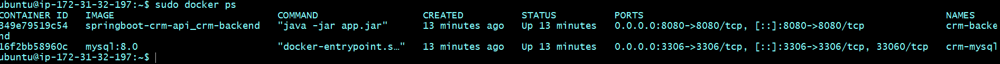
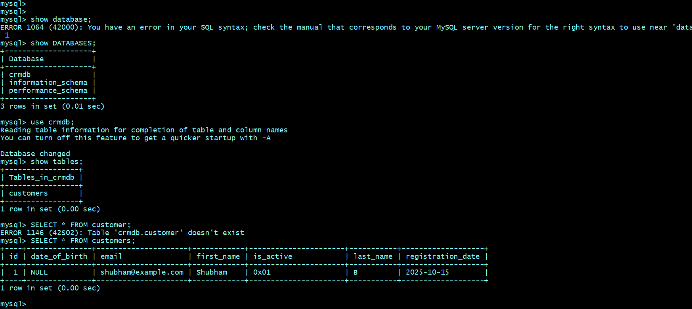
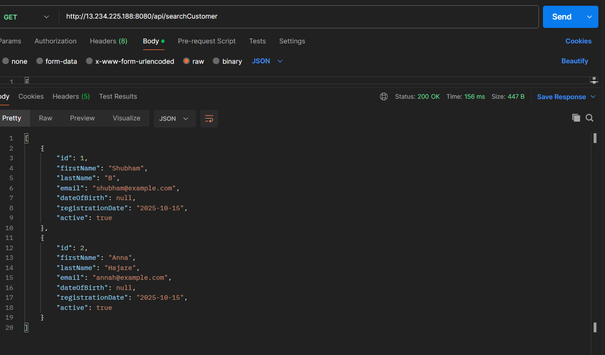
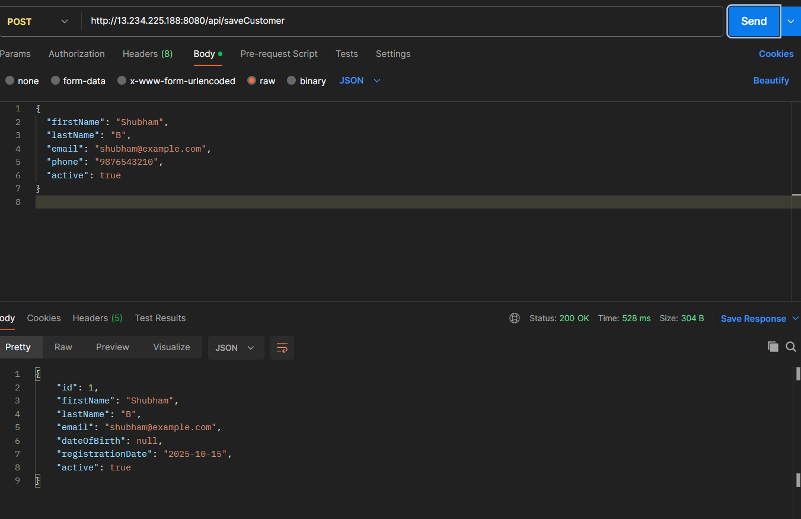
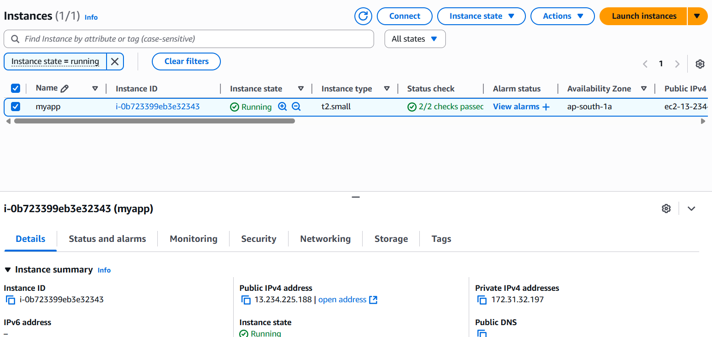

# Spring Boot CRM Backend – Dockerized

This repository contains a **Spring Boot CRM backend project** that has been containerized using **Docker** and **Docker Compose**.  
It uses **MySQL** as the database and demonstrates a production-ready container setup.

---

## **Project Structure**

crm-backend/
├── src/
├── pom.xml
├── Dockerfile
├── docker-compose.yml
├── .dockerignore
└── target/

---

## **Dockerization Steps**

### 1️⃣ Create Dockerfile

A `Dockerfile` was added in the root to define the application container:

```dockerfile
FROM openjdk:17-jdk-slim
WORKDIR /app
COPY target/*.jar app.jar
EXPOSE 8080
ENTRYPOINT ["java", "-jar", "app.jar"]
```

===============================================
Uses OpenJDK 17 slim image

Copies the built JAR file into the container

Exposes port 8080 for the Spring Boot application

2️⃣ Create Docker Compose File

A docker-compose.yml was added to run both the CRM backend and MySQL database:

Runs MySQL and CRM backend in separate containers

Uses a persistent volume for MySQL

Connects containers on a shared network

Spring Boot reads database credentials from environment variables

3️⃣ Build and Run Containers

Build the project JAR:

mvn clean package -DskipTests

Run Docker Compose:

sudo docker-compose up -d --build

4️⃣ Verify

sudo docker ps
CONTAINER ID   NAME          PORTS

a1b2c3d4e5f6   crm-backend   0.0.0.0:8080->8080/tcp
b2c3d4e5f6g7   crm-mysql     0.0.0.0:3306->3306/tcp


5️⃣ Access Database
sudo docker exec -it crm-mysql mysql -u crmuser -p

USE crmdb;
SHOW TABLES;
SELECT * FROM customer;

6️⃣ Security

Ensure port 8080 and 3306 are allowed in AWS Security Group if running on EC2

### **8️⃣ Screenshots**

**1. Docker Containers Running**



**2. MySQL Tables**



**3. CRM API in Postman**



**4. CRM API in Postman POST**


**5. Aws Ec2 Instance **



✅ Summary

Dockerfile: Defines Spring Boot app container

Docker Compose: Runs backend + MySQL together

Volumes: Persist database data

Environment variables: Manage database credentials dynamically

AWS-ready: Can run on EC2 or any Linux server
